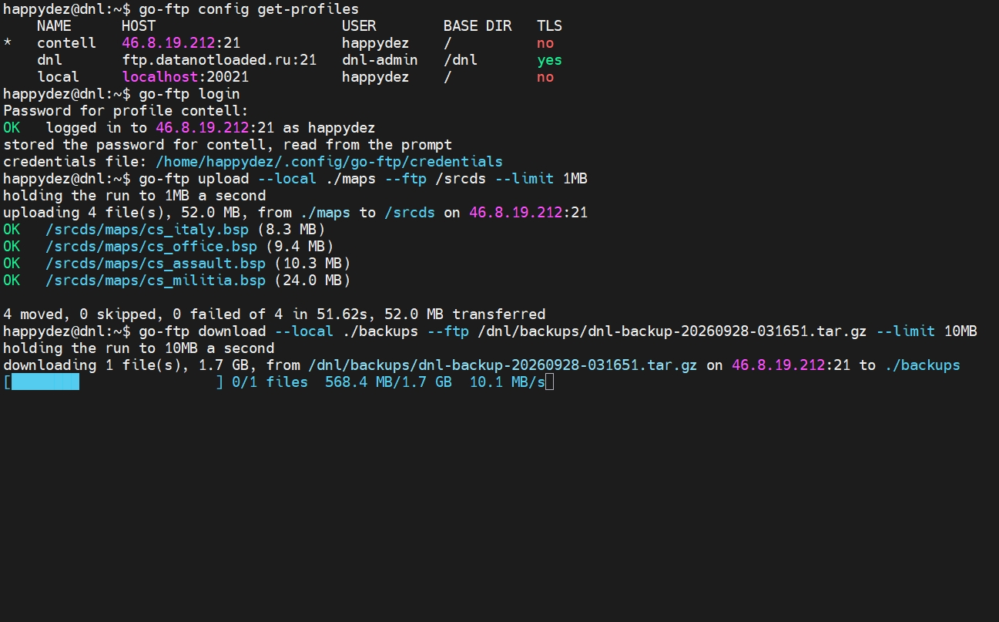

# go-ftp

A command line tool for moving files to and from an FTP server.

You describe your servers once in a config file, keep the passwords out of it,
and then upload or download a whole folder with one command. Files travel in
parallel, a failed one is retried, and what did not make it is listed at the end
instead of scrolling past.

```
$ go-ftp upload --local ./maps --ftp /srcds --limit 1MB
holding the run to 1MB a second
uploading 4 file(s), 52.0 MB, from ./maps to /srcds on ftp.example.com:21
OK   /srcds/maps/map_a.bsp (8.3 MB)
OK   /srcds/maps/map_b.bsp (9.4 MB)
OK   /srcds/maps/map_c.bsp (10.3 MB)
OK   /srcds/maps/map_d.bsp (24.0 MB)

4 moved, 0 skipped, 0 failed of 4 in 51.62s, 52.0 MB transferred
```

## Installing

Download the binary from
[Releases](https://github.com/happydez/go-ftp/releases) and put it somewhere on
your `PATH`. There is nothing to install alongside it.

From a clone, with [Task](https://taskfile.dev):

```
task build       # for this machine, into ./bin
task build-all   # linux/amd64 and windows/amd64
```

## Getting started

Put a `go-ftp.yml` next to the binary:

```yaml
current_profile: local

profiles:
  local:
    host: 127.0.0.1
    port: 21
    user: user
    base_dir: /
```

Store the password once. It is checked against the server before it is saved, so
a typo is caught now rather than on your first upload:

```
go-ftp login
```

Then:

```
go-ftp upload   --local ./data --ftp /       # send a folder
go-ftp download --local .      --ftp /data   # bring it back
go-ftp ls -R                                 # see what is up there
```

Add `--dry-run` to any transfer to see what would move without moving it.

## The config

The file is searched for in this order, and the first one found wins:

1. The path given to `--config`
2. `$GOFTP_CONFIG`
3. `./go-ftp.yml` or `./go-ftp.yaml`
4. The same two names next to the binary
5. `~/.config/go-ftp/config.yml`, or `%AppData%\go-ftp\config.yml` on Windows

Everything it can hold:

```yaml
# Copy this to go-ftp.yml next to the binary, or to the user config directory
# (~/.config/go-ftp/config.yml, %AppData%\go-ftp\config.yml on Windows).
#
# There are no passwords here. Run `go-ftp login`
# to store one, or pass it in GOFTP_PASSWORD.

current_profile: local

profiles:
  local:
    host: 127.0.0.1
    port: 21
    user: user
    # Every remote path a command is given is resolved against this directory,
    # and nothing above it can be reached.
    base_dir: /my
    tls: false

  prod:
    host: ftp.example.com
    port: 21
    user: deploy
    base_dir: /upload
    # Explicit FTPS over AUTH TLS.
    tls: true
    # Accept a certificate that does not verify. Only for a server you know.
    tls_insecure: false

transfer:
  # Files in flight at once. Every worker holds its own FTP connection.
  workers: 4
  # Attempts per file on top of the first try.
  max_retries: 3
  # A deadline for the whole run, not for one file. 0 means no limit and that
  # is the default, so that a big upload does not die on a wall clock.
  timeout: 0

  # How fast bytes may travel, added up over the whole run rather than per
  # connection. 0 means no limit. KB and MB are 1024 based here, matching what
  # the tool prints.
  upload_limit: 0
  download_limit: 0
```

There are no passwords in it, so it is safe to commit. See
[`go-ftp.example.yml`](go-ftp.example.yml) for the same thing with comments.

Switch servers without editing anything:

```
go-ftp upload --local ./data --ftp / -p staging
go-ftp config use-profile staging     # or make the switch stick
go-ftp config get-profiles            # see them all
```

## Passwords

`go-ftp login` writes the password to a file of its own, kept out of the config
and readable only by you: `~/.config/go-ftp/credentials`, or
`%AppData%\go-ftp\credentials` on Windows.

For a script or a CI job there are two ways in that never touch the disk:

```
echo "$PASSWORD" | go-ftp login --password-stdin
GOFTP_PASSWORD=... go-ftp upload --local ./data --ftp /
```

`go-ftp whoami` shows which profile is active, which server it points at, and
where its password is coming from. It logs in to prove the answer. `go-ftp
logout` forgets it again.

## Commands

| | |
| --- | --- |
| `upload --local PATH --ftp DIR` | send a file or a folder |
| `download --ftp PATH --local DIR` | fetch a file or a folder |
| `ls [PATH]` | list a directory, `-R` for everything under it |
| `mv SOURCE DEST` | rename something on the server |
| `rm PATH` | delete a file, `-r` for a whole tree |
| `login` / `logout` / `whoami` | the password and who you are |
| `config view` / `get-profiles` / `use-profile` | look at and change the config |
| `version` | what you are running |
| `completion` | shell completion for bash, zsh, fish or powershell |

Useful flags on `upload` and `download`:

| | |
| --- | --- |
| `--dry-run` | print what would move and stop |
| `--skip-existing` | leave files whose size already matches |
| `--contents` | send what is inside the folder instead of the folder itself |
| `--limit 2MB` | hold this run to a speed |
| `--workers 8` | more or fewer files at once than the config says |

Run `go-ftp <command> --help` for the rest.

## Example

